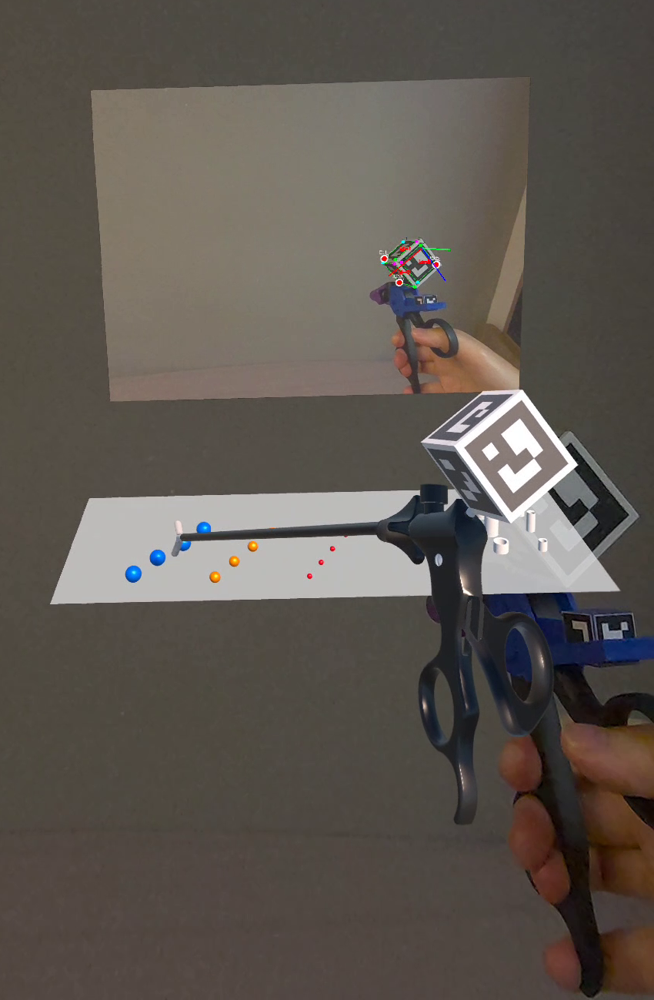
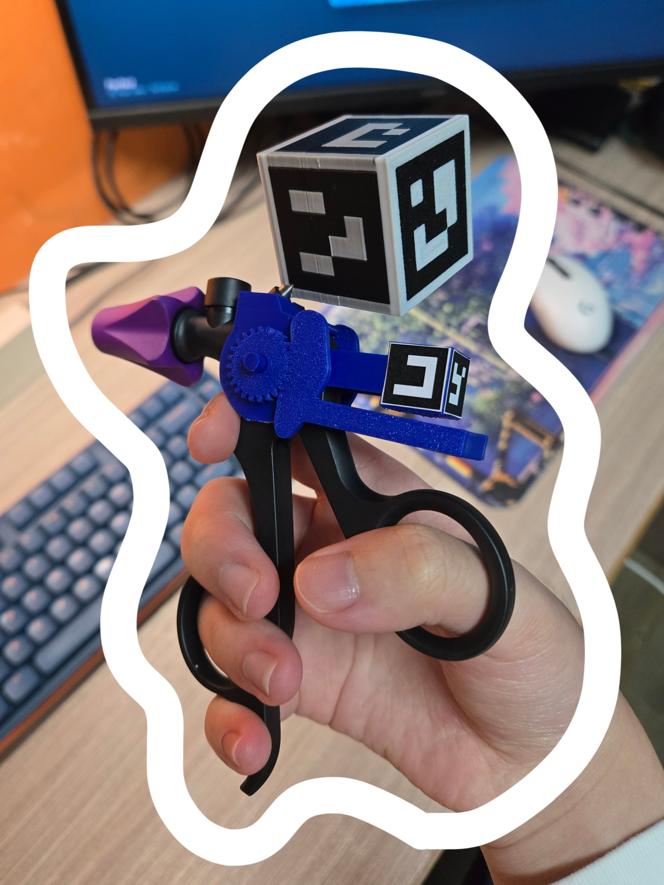
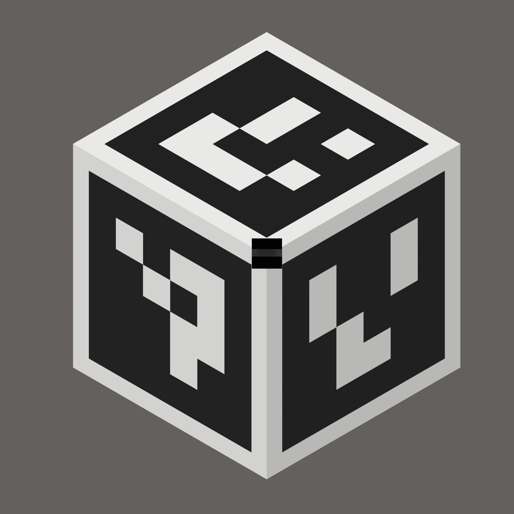
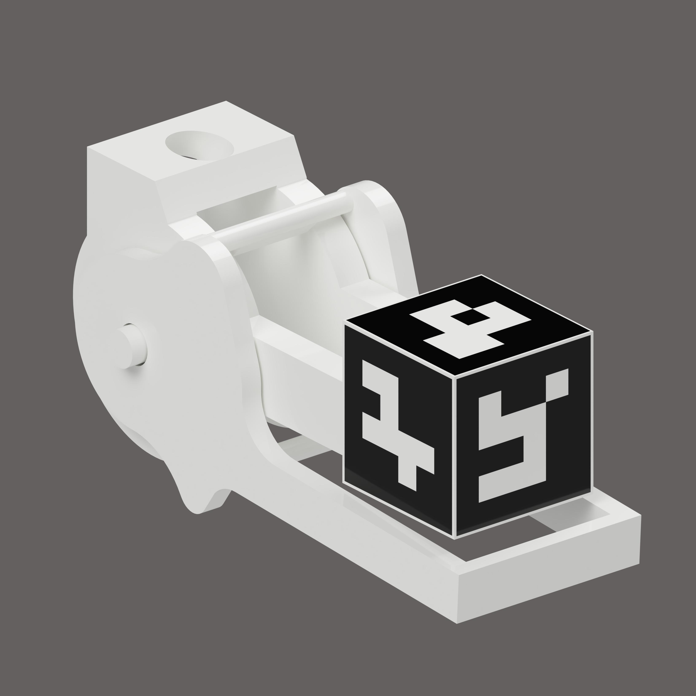

# ArUco-Based 6DOF Laparoscopic Forceps Tracking for Meta Quest 3

### *Extended Reality Surgical Training with Computer Vision*

[](https://unity.com/)
[](https://www.meta.com/quest/)
[](https://opencv.org/)
[](https://opensource.org/licenses/MIT)

<p align="left">
  <a href="https://www.meta.com/quest/quest-3/">
    
  </a>
</p>

## Overview

Real-time 6DOF tracking of laparoscopic surgical forceps using ArUco marker detection on Meta Quest 3's passthrough cameras. This system enables controller-free, precise tracking and interaction with virtual objects in mixed reality surgical training scenarios.

### 🎥 Demo Video

<div align="center">

<a href="https://drive.google.com/file/d/1hKMK9hxnVVk6sPYRvNClHU6z29GJnme-/view?usp=drive_link">
  
</a>

*Click image above to watch full demonstration video*

</div>

### Key Features

- **Computer vision-based 6DOF tracking** using ArUco markers (no controllers required)
- **Marker visibility-based clamp control** with OR logic (any marker visible → close, all hidden → open)
- **Size-adaptive object grasping** with geometric angle calculation
- **Multi-attach-point system** for different object sizes
- **One Euro Filter smoothing** for stable tracking with adaptive parameters
- **Anti-regrab cooldown** mechanism to prevent object teleportation after release

---

## Hardware Setup

<table>
<tr>
<td width="50%">

<p align="center"><b>Complete Assembly</b><br>Laparoscopic forceps with 3D printed marker mounts</p>
</td>
<td width="50%">

<p align="center"><b>6DOF Tracking Cube</b><br>ArUco markers (IDs 0-5) for pose estimation</p>
</td>
</tr>
<tr>
<td width="50%">

<p align="center"><b>Visibility Control Handles</b><br>Markers (IDs 9, 6, 10) for clamp state control</p>
</td>
<td width="50%">

<p align="center"><b>System in Action</b><br>Real-time tracking with Meta Quest 3 passthrough</p>
</td>
</tr>
</table>

---

## Technical Architecture

### System Pipeline

```
Meta Quest 3 Passthrough Camera (30Hz, 1280×960)
            ↓
    ArUcoMarkerTracking.cs (OpenCV Detection)
            ↓
    MarkerCornerExtractor.cs (3D World Corners)
            ↓
    RigidCubeAxesMinimal.cs
    ├─ 6DOF Pose Estimation (markers 0-5)
    ├─ One Euro Filter Smoothing
    └─ Visibility Detection (markers 9,6,10)
            ↓
    ForcepsController.cs
    ├─ ArUco Grab/Release State Machine
    ├─ Geometric Angle Calculation
    └─ Clamp Freeze Mechanism
            ↓
    CustomXRDirectInteractor.cs (XR Toolkit)
            ↓
    XRGrabInteractable Objects
```

### Core Components

#### 1. ArUco Marker Tracking (`RigidCubeAxesMinimal.cs`)

Tracks 6 ArUco markers (IDs 0-5) mounted on a rigid cube attached to the forceps handle using Meta Quest 3's passthrough camera at 1280×960 resolution and 30Hz update rate.

**Features:**
- Board-based pose estimation using OpenCV's `solvePnP`
- One Euro Filter with adaptive parameters based on marker count
- Dynamic smoothing adjustment (stronger filtering with fewer markers)

#### 2. Marker Visibility Control

Monitors 3 visibility markers (IDs 9, 6, 10) to control clamp state using OR logic:
- **ANY marker visible** → clamps CLOSE
- **ALL markers hidden** → clamps OPEN

Implements frame confirmation system (3 consecutive frames) to prevent detection jitter and uses Lerp smoothing for gradual state transitions.

#### 3. Geometric Angle Calculation (`ForcepsController.cs`)

Calculates optimal clamp closing angle based on object size and attach point position using vector geometry:

```csharp
Vector3 middle = (upperClamp.position + lowerClamp.position) * 0.5f;
Vector3 clampLine = (upperClamp.position - lowerClamp.position).normalized;
Vector3 attachDir = (attachPoint.position - middle).normalized;
float geometricAngle = Vector3.Angle(attachDir, clampLine);

// Map 30°-70° geometric angle to -85° to -50° rotation
float t = Mathf.Clamp01((geometricAngle - 30f) / 40f);
float targetAngle = Mathf.Lerp(-85f, -50f, t);
```

**Size-Adaptive Behavior:**
- **Small ball** (0.01m radius) → outer attach point → geometric angle ~70° → rotation -50° (more open)
- **Medium ball** (0.015m radius) → middle attach point → geometric angle ~50° → rotation -67.5°
- **Large ball** (0.02m radius) → inner attach point → geometric angle ~30° → rotation -85° (more closed)

#### 4. Multi-Attach-Point System (`CustomXRDirectInteractor.cs`)

Extended `XRDirectInteractor` with multiple attach transforms:
- Automatically selects closest attach point to target object
- Locked attach transform during grab (prevents switching mid-interaction)
- Cache system for efficient distance calculations

---

## Requirements

### Development Environment

- **Unity Hub:** 3.12.1+
- **Unity Editor:** 2022.3 LTS
- **Build Platform:** Android

### Required Packages

- Meta XR SDK 57.0+
- OpenCV for Unity 2.5.9+
- XR Interaction Toolkit 2.6.4+
- XR Plugin Management 4.4.0+
- Oculus XR Plugin 3.2.3+
- Quest Horizon OS v74+

### Platform Support

- **Meta Quest 3** (primary target)
- **Meta Quest 3S** (supported)

---

## Installation

### 1. Clone Repository

```bash
git clone https://github.com/WestCoastGod/XR-CV-Forceps-Tracking-Unity.git
cd XR-CV-Forceps-Tracking-Unity
```

### 2. Unity Project Setup

1. Open project in Unity Hub (Unity 2022.3 LTS)
2. Import OpenCV for Unity from Asset Store
3. Configure XR Plugin Management:
   - Edit → Project Settings → XR Plug-in Management
   - Enable Oculus for Android platform
4. Build Settings:
   - File → Build Settings
   - Switch Platform to Android
   - Configure Quest-specific settings

### 3. 3D Printed Hardware

**3D Print Files (3MF format):**
- [`Marker_Tracking_Cube.3mf`](Source/Marker_Tracking_Cube.3mf) - Rigid cube mount for 6DOF tracking markers
- [`Clamps_Control_Handle.3mf`](Source/Clamps_Control_Handle.3mf) - Handle mount for visibility control markers

**Printing Notes:**
- Files can be opened with most 3D modeling applications (Blender, Fusion 360, PrusaSlicer, Cura, etc.)
- Recommended material: PLA or PETG
- Print with adequate infill (20%+) for structural rigidity
- Print orientation: flat surfaces down for better adhesion

### 4. ArUco Marker Setup

1. **Print 9 ArUco markers** (DICT_4X4_50):
   - IDs 0-5: Cube face markers (6DOF tracking)
   - IDs 9, 6, 10: Visibility control markers

2. **Marker specifications:**
   - Size: 65-100mm per marker (larger = better long-range detection)
   - Material: Rigid substrate (foam board, cardboard, or plastic)
   - Print quality: High contrast, clean black/white boundaries
   - Border: Ensure white border around black marker pattern

3. **Physical Assembly:**
   - Attach markers 0-5 to the 3D printed tracking cube
   - Attach visibility markers 9, 6, 10 to the 3D printed control handles
   - Mount cube assembly to forceps handle
   - Mount control handles to forceps clamp handles
   - Ensure markers are flat and securely mounted

### 4. Component Configuration

**RigidCubeAxesMinimal:**
```
Marker Length Meters: 0.065  (adjust to your printed marker size)
Position Min Cutoff: 0.05    (lower = smoother)
Position Beta: 0.0           (speed coefficient)
Visibility Marker IDs: [9, 6, 10]
Visibility Smoothing: 0.5
```

**ForcepsController:**
```
Ball Size Mapping:
  Small: 0.01m, Medium: 0.015m, Large: 0.02m
```

**CustomXRDirectInteractor:**
```
Use Multiple Attach Transforms: true
Attach Transforms: [OuterAttach, MiddleAttach, InnerAttach]
```

---

## Usage

1. Launch application on Meta Quest 3
2. Point passthrough cameras at ArUco cube on forceps
3. Wait for tracking initialization (cube model appears)
4. Position a ball between the forceps clamps
5. **Hide markers** (cover 9,6,10 with hand) → clamps **CLOSE** and grab ball
6. **Show markers** (remove hand) → clamps **OPEN** and release ball

### Troubleshooting

**Tracking lost or jittery:**
- Ensure good lighting (avoid direct sunlight or very dim conditions)
- Keep at least 3-4 markers visible at all times
- Reduce movement speed (motion blur affects detection)
- Check marker print quality and flatness

**Clamps not responding:**
- Verify visibility markers 9, 6, 10 are correctly positioned
- Check marker IDs match configuration
- Enable debug logging to monitor marker detection

**Incorrect grab angles:**
- Verify ball size mappings in ForcepsController
- Check attach point positions on clamp model
- Review geometric angle calculation parameters

---

## Performance

| Metric | Value | Notes |
|--------|-------|-------|
| **Tracking Rate** | 30 Hz | Limited by Meta Passthrough Camera API |
| **Latency** | 40-60ms | Camera capture + processing pipeline |
| **Position Accuracy** | ±5mm | With 6 markers visible in good lighting |
| **Rotation Accuracy** | ±2° | Board-based pose estimation |
| **GPU Overhead** | ~1-2% | Per camera stream |
| **Memory Overhead** | ~45MB | Passthrough API baseline |
| **Max Detection Range** | ~2m | Depends on marker size and lighting |

### Known Limitations

**Hardware Limitations:**
- 30Hz update rate causes visible jitter at forceps tips due to lever arm amplification
- 1280×960 camera resolution limits marker detection accuracy beyond 1.5-2m distance
- Motion blur during fast movements degrades tracking quality

**Environmental Factors:**
- Poor lighting conditions reduce marker detection reliability
- Highly reflective surfaces can interfere with marker recognition
- Camera auto-exposure adjustment can cause temporary tracking instability

### Future Enhancements

**High Priority:**
- **IMU sensor fusion** (200-500Hz) for rotational stability
- **Kalman filtering** for predictive tracking and latency compensation
- **Larger markers** (80-100mm) for extended detection range

**Medium Priority:**
- Multi-tool simultaneous tracking support
- Advanced filtering algorithms (complementary filters, particle filters)
- Performance optimization (multi-threaded detection, GPU-accelerated pose estimation)

---

## Project Structure

```
Assets/Scripts/
├── ArUcoMarkerTracking.cs        # OpenCV ArUco detection wrapper
├── MarkerCornerExtractor.cs      # 3D corner extraction from detected markers
├── RigidCubeAxesMinimal.cs       # Main tracking + visibility control
├── RigidBodyPoseEstimator.cs     # 6DOF pose estimation from markers
├── OneEuroFilters.cs             # Position/rotation smoothing filters
├── ForcepsController.cs          # Grab/release logic + geometric calculation
├── CustomXRDirectInteractor.cs   # Multi-attach-point XR interactor
├── UpperClamp.cs                 # Upper clamp trigger detection
├── LowerClamp.cs                 # Lower clamp trigger detection
└── DiceCADModel.cs               # ArUco cube CAD model definition
```

---

## Testing Results

### Tracking Accuracy

- ✅ ±5mm accuracy within 1.5m range
- ✅ Stable with 4+ markers visible

### Clamp Angle Validation

| Ball Size | Attach Point | Target Angle | Status |
|-----------|-------------|--------------|--------|
| Small | Outer | -50° | ✅ |
| Medium | Middle | -67.5° | ✅ |
| Large | Inner | -85° | ✅ |

### Visibility Logic

| Markers | Clamp State | Status |
|---------|-------------|--------|
| None | OPEN | ✅ |
| Any 1-3 | CLOSE | ✅ |

---

## Contributing

Contributions welcome! Key areas:

- IMU sensor fusion implementation
- Kalman filtering for predictive tracking
- Performance optimization
- Multi-tool tracking support

---

## References

- [Meta Passthrough API](https://developer.oculus.com/documentation/unity/unity-passthrough/)
- [OpenCV ArUco Module](https://docs.opencv.org/4.x/d5/dae/tutorial_aruco_detection.html)
- [One Euro Filter Paper](https://hal.inria.fr/hal-00670496/document)
- [Unity XR Interaction Toolkit](https://docs.unity3d.com/Packages/com.unity.xr.interaction.toolkit@2.6/)

---

## License

This project is licensed under the MIT License - see the [LICENSE](LICENSE) file for details.

---


**Repository:** https://github.com/WestCoastGod/XR-CV-Forceps-Tracking-Unity

---

